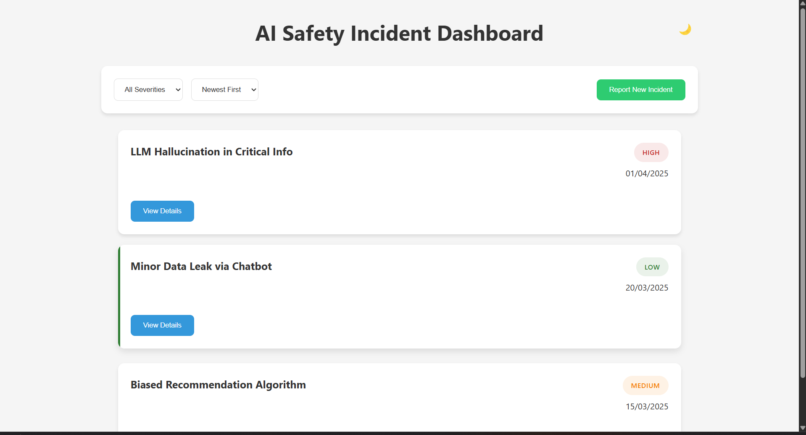
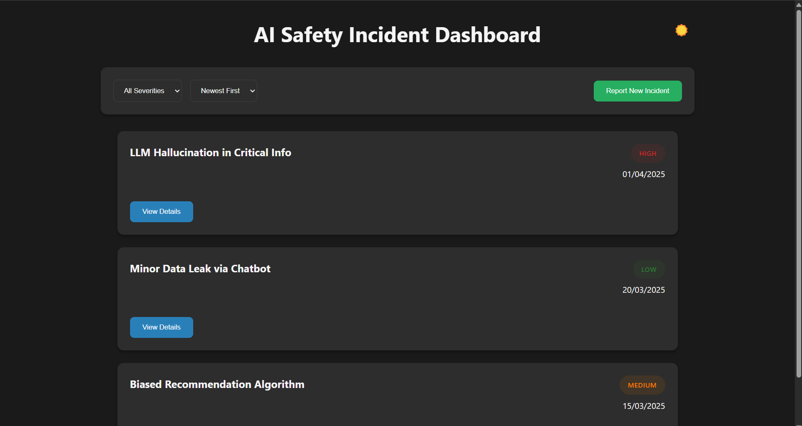
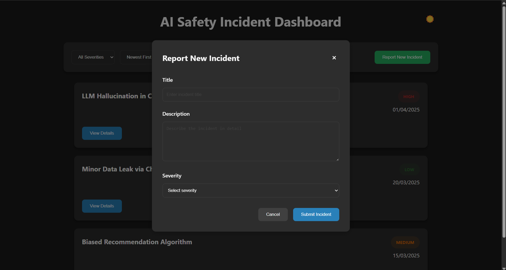

# 🚨 AI Safety Incident Dashboard

A React-based dashboard for tracking and managing AI safety incidents. The application features a modern UI with light/dark mode support, local storage for data persistence, and a modal form for reporting new incidents. Users can filter and sort incidents by severity and date, and view detailed descriptions of each incident.

---

## 🛠️ Tech Stack & Framework Choices

### Frontend Framework
- **React.js with Vite**: Chosen for its fast development experience, hot module replacement, and optimized build process
- **JavaScript (ES6+)**: Used for its wide browser support and modern features
- **CSS with CSS Variables**: For theme support and maintainable styling

### Key Dependencies
- **React Hooks**: For state management and side effects
- **Local Storage API**: For data persistence
- **CSS Flexbox/Grid**: For responsive layouts

---

## 🚀 Installation & Local Development

### Prerequisites
- Node.js (v14 or higher)
- npm (v6 or higher)

### Step-by-Step Setup

1. **Clone the Repository**
```bash
git clone https://github.com/Rahul-0410/SPARKLEHOOD_Assignment.git
cd dashboard
```

2. **Install Dependencies**
```bash
npm install
```

3. **Start Development Server**
```bash
npm run dev
```

4. **Build for Production**
```bash
npm run build
```

5. **Preview Production Build**
```bash
npm run preview
```

The application will be available at:
- Development: http://localhost:5173
- Production Preview: http://localhost:4173

---

## 🏗️ Project Structure

```
dashboard/
├── src/
│   ├── components/     # Reusable UI components
│   │   ├── IncidentForm.jsx    # Modal form for new incidents
│   │   └── ThemeToggle.jsx     # Theme switcher component
│   ├── data/          # Mock data and data management
│   │   └── mockIncidents.js    # Initial incident data
│   ├── utils/         # Utility functions
│   │   └── storage.js         # Local storage operations
│   ├── App.jsx        # Main application component
│   ├── App.css        # Global styles
│   └── main.jsx       # Application entry point
└── README.md
```

---

## 💡 Design Decisions & Challenges

### State Management
- **Local Storage**: Chosen over a backend database for simplicity and to demonstrate frontend data persistence
- **React Hooks**: Used for state management to keep the code clean and maintainable
- **Component Structure**: Separated concerns into reusable components for better maintainability

### UI/UX Design
- **Modal Form**: Implemented to provide a focused interface for incident reporting
- **Theme Support**: Added for better user experience in different lighting conditions
- **Responsive Design**: Ensures usability across different device sizes

### Challenges Overcome
1. **Data Persistence**: Implemented a robust local storage system that maintains data across sessions
2. **Form Validation**: Added client-side validation to ensure data integrity
3. **Theme Switching**: Created a smooth transition between light and dark modes
4. **Mobile Responsiveness**: Ensured the dashboard works well on all screen sizes

---

## ✨ Features

✅ Display list of AI safety incidents with Title, Severity, and Reported Date  
✅ Filter incidents by Severity (All, Low, Medium, High)  
✅ Sort incidents by Reported Date (Newest First, Oldest First)  
✅ View detailed descriptions of incidents  
✅ Report new incidents through a modal form  
✅ Persistent data storage using **localStorage**  
✅ Modern UI with light/dark mode support  
✅ Responsive design for all screen sizes  
✅ Smooth animations and transitions  

---

## 💾 State Management & Data Persistence

### useState:
- `incidents` → Stores the list of AI safety incidents
- `severityFilter` → Manages the current severity filter
- `sortOrder` → Controls the sorting order of incidents
- `expandedIncident` → Tracks which incident's details are expanded
- `showForm` → Controls the visibility of the incident form modal

### useEffect:
- Loads incidents from localStorage on component mount
- Initializes with mock data if no stored incidents exist

### Local Storage:
- Persists all incident data between page reloads
- Stores new incidents added through the form
- Maintains data consistency across sessions

---

## 🎨 UI/UX Features

### Modal Form:
- Clean, centered design
- Input validation
- Smooth animations
- Close button and auto-close on submit

### Theme Support:
- Light and dark mode
- Smooth theme transitions
- Consistent styling across themes

### Responsive Design:
- Adapts to different screen sizes
- Mobile-friendly layout
- Readable typography
- Accessible color contrast

---

## 📱 Screenshots

### Light Mode


### Dark Mode


### Modal Form


---

## 🔧 Future Improvements

- Add incident editing and deletion functionality
- Implement user authentication
- Add data export/import features
- Include incident statistics and charts
- Add search functionality
- Implement incident categories/tags
- Add comment system for incidents

---

## 📝 License

This project is licensed under the MIT License - see the [LICENSE](LICENSE) file for details.
